<h1 align="center">【ｓａｎｇｒｅｇｏｒｉｏｋｉｍｐｏ】</h1>
<h1 align="center">𝐪𝐮𝐚𝐥𝐢𝐭𝐲 𝐦𝐚𝐤𝐞𝐬 𝐚 𝐤𝐢𝐦𝐩𝐨</h1>
<!-- <h1 align="center" style="font-size: 1px;">𝐑𝐨𝐛𝐨𝐭𝐢𝐜𝐢𝐬𝐭</h1> -->

----------------------------------------------------------------------------------------------------------------------------------------------------------------------------------------------------

----------------------------------------------------------------------------------------------------------------------------------------------------------------------------------------------------

<!-- Tech Stack (Badges) -->

)

  

  

  
  
  

